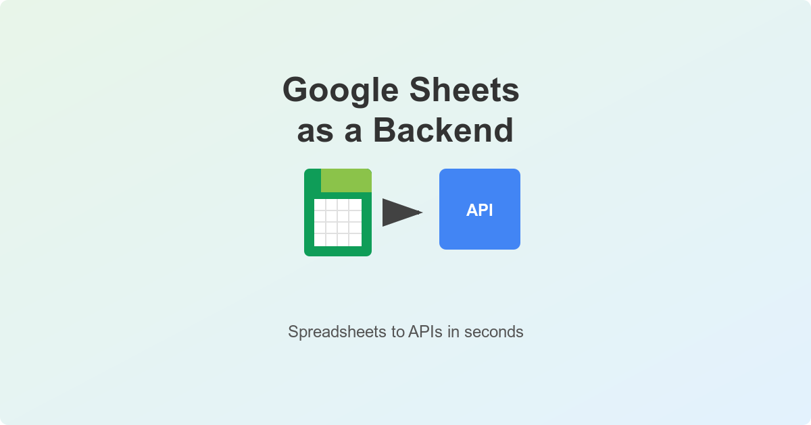

# Google Sheets Backend

Transform your Google Sheets into a powerful REST API backend with just a few clicks.



## Features

- Turn any Google Sheet into a REST API endpoint
- Simple setup process
- JSON response format
- Free to use

## Quick Start

1. Share your Google Sheet with the service account email provided on the homepage
2. Make API calls to your sheet data:

```bash
curl -X GET "https://google-sheets-backend.canine.sh/sheet/{your-sheet-id}/{your-sheet-name}"
```

## API Response Format

```json
{
  "data": [
    {
      "column1": "value1",
      "column2": "value2"
    }
  ]
}
```

## Development Setup

1. Clone the repository
2. Install dependencies:
```bash
pip install -r requirements.txt
```
3. Set up environment variables:
```bash
SERVICE_ACCOUNT_EMAIL=your-service-account@email.com
CREDENTIALS_JSON_BASE64=your-base64-encoded-credentials
```
4. Run the server:
```bash
fastapi dev main.py
```

## License

MIT License 